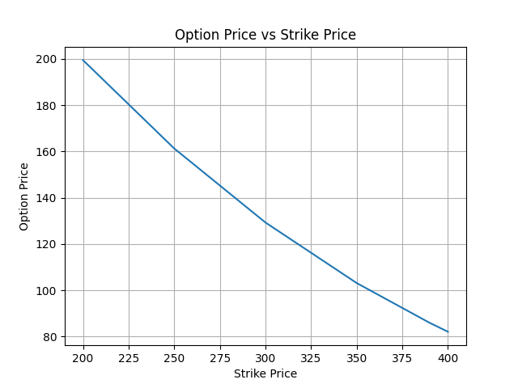

# Option Pricing Python

A Python-based quantitative finance project for pricing options and analyzing derivatives.

## Features

- European Option Pricing (Black-Scholes Model)
- Binomial Tree Option Pricing
- Monte Carlo Option Pricing
- Greeks Calculation
  - Delta
  - Gamma
  - Vega
  - Theta
  - Rho
- Implied Volatility Calculation
- Historical Market Data Fetching
- Option Price Visualization

## Project Structure

```text
option_pricing/
│
├── american_option_pricing.py
├── base_option_pricing.py
├── binomial_tree.py
├── data_fetcher.py
├── european_option_pricing.py
├── greeks.py
├── implied_volatility.py
├── monte_carlo_pricing.py
├── option_visualization.py
├── requirements.txt
└── README.md
```

## Installation

Clone the repository:

```bash
git clone https://github.com/pawansigar570-arch/option_pricing-python.git
cd option_pricing-python
```

Install dependencies:

```bash
pip install -r requirements.txt
```

## Usage

### European Option Pricing

```python
from european_option_pricing import EuropeanOptionPricing
import datetime

option = EuropeanOptionPricing(
    ticker="TSLA",
    expiry_date=datetime.datetime(2028, 1, 1),
    strike=300,
    dividend=0
)

call_price, put_price = option.calculate_option_prices()

print("Call Price:", call_price)
print("Put Price:", put_price)
```

### Greeks Calculation

```python
greeks = option.calculate_greeks()

print("Delta =", greeks["Delta"])
print("Gamma =", greeks["Gamma"])
print("Vega =", greeks["Vega"])
print("Theta =", greeks["Theta"])
print("Rho =", greeks["Rho"])
```

### Implied Volatility

```python
iv = implied_volatility_call(
    call_price,
    option.spot_price,
    option.strike_price,
    option.time_to_maturity,
    option.risk_free_rate
)

print("Implied Volatility =", iv)
```

## Visualization

Run:

```bash
python option_visualization.py
```

This generates a graph showing the relationship between strike price and option price.

## Option Price vs Strike Price



## Models Implemented

| Model | Status |
|---------|---------|
| Black-Scholes | ✅ |
| Binomial Tree | ✅ |
| Monte Carlo | ✅ |
| Greeks | ✅ |
| Implied Volatility | ✅ |
| Visualization | ✅ |

## Author

Pawan Yadav

B.Tech, Metallurgical and Materials Engineering

NIT Raipur
